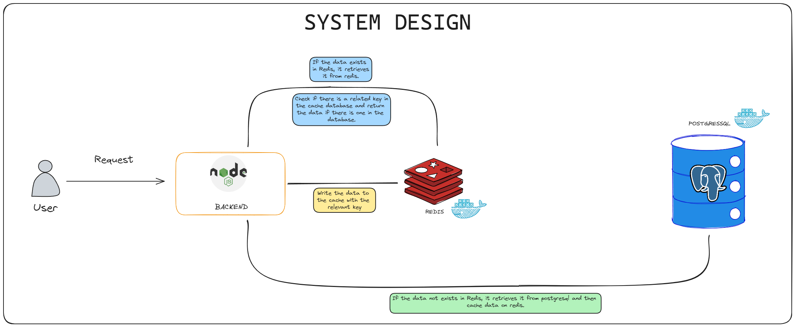

# TTN E-Ticaret

Bu projenin amacı, bir e-ticaret platformu için siparişlerin oluşturulması, düzenlenmesi, kampanyaların uygulanması (Kampanyalar kupon kodu ile çalışmalıdır) ve sipariş detaylarının görüntülenmesi için bir API geliştirmektir.

## Teknolojiler

- Dil: Node.js ( Javascript )
- Framework: Express.js
- Veritabanı: PostgreSQL
- Ek Teknolojiler: Docker, Redis

## Özellikler

Proje detaylarında verilen özelliklerden yapılanlar. (ekstralar yazılmamıştır)

### Kupon Kodu Kontrol Servisi:

Projede kullandığım kupon kodu formatını kontrol eden bir algoritma yazıldı. Kupon formatına örnek bir kupon "TTN2024TTTTTTT1" şeklindedir. İki sayı arasında en az 3 adet 'T' karakteri bulunmalıdır.

Geçersiz kod: `TTN2024TT001`, `TTN2024TT2TT`, `TTNTTTTT001`

Geçerli Kod: `TTN2024TTT001`, `TTN2024TTTT01`, `TTN2TTTTT001`

### Sipariş Oluşturma Servisi:

- Ürün stok kontrolü yapıldı.
- Toplam sipariş tutarı 500 TL üzeri ise kargo bedava olmalı, değilse 54.99 TL kargo bedeli tahsil ediliyor.

##### Kupon kodu varsa:

- Sepet tutarı 1000 TL'yi aştığında %10 indirim uygulanmalı.
- Sepet tutarı 1500 TL'yi aştığında, önceki indirim iptal ediliyor ve %15 indirim uygulanıyor.
- Sepet tutarı 2000 TL'yi aştığında, önceki indirim iptal ediliyor ve %20 indirim uygulanıyor.
- Sepet tutarı 3000 TL'yi aştığında, önceki indirim iptal ediliyor ve %25 indirim uygulanıyor. Ayrıca, müşteri 1 KG kahve kazanıyor.

### Sipariş Düzenleme Servisi:

- Siparişlerdeki bir ürünün adetinin arttırılması/azaltılması veya ürünün silinmesi gibi işlemleri yapacak bir servis oluşturuldu.

### Sipariş Detayı Görüntüleme Servisi:

- Verilen sipariş numarasına ait siparişin detayları, indirimli/indirimsiz tutarlar, ürünler ve faydalanılan kampanyalar gibi bilgileri gösterecek bir servis oluşturuldu.

### Bonuslar:

- Sipariş tamamlandıktan sonra sipariş onay maili gönderilmesi. `NODEMAILER`
- Veri önbellekleme (cache) kullanılması. `REDIS`

### Dikkat Edilmesi Gerekenler:

- Servis isteklerinde validasyonların yapılması ve ilgili hata kodları ve mesajlarının dönülmesi.
- Verilerin düzenli bir şekilde tutulması ve veritabanı tablolarının yapısal olarak esnek tasarlanması.
- Performans odaklı geliştirme.
- Ana verilerin (kullanıcılar, kategoriler, ürünler vb.) projenin kurulumunda bir seeder veya benzeri araçlarla eklenebilmesi.
- Proje için bir README dosyası hazırlanması.
- Git süreçlerinin ekip çalışmasına uygun şekilde yönetilmesi.

### Kısaca Ekstralar

- Category, Product, Coupon, Order ve CartItem modelleri oluşturuldu. Aralarında ilişkiler kuruldu.
- Api istekleriyle product ve coupon harici bir şekilde eklenebiliyor, düzenlenebiliyor, görüntülenebiliyor ve silinebiliyor.
- Sipariş oluşturulurken kupon kodu istenilen validasyona ek olarak veritabanında var olup olunmadığı ve aktiflik durumuna göre yapılıyor.
- Veri tabanı ve redis, docker üzerinde çalıştırılmıştır.
- Postman dökümantasyonu hazırlandı.

## Bilgisayarınızda Çalıştırın

### PostgreSQL (opsiyonel) ve Redis Kurulumları

##### Docker Kurulumu

https://www.docker.com/get-started/kurulum burdan takip edilebilir

##### Redis Kurulumu

```bash
  docker network create redis

  docker run -d --name localredis --restart always -p 6379:6379 --network redis redis

  docker run -d --name rediscommanderlocal --restart always --network redis -e REDIS_HOSTS=local:localredis:6379 -p 8081:8081 rediscommander/redis-commander
```

Redis, 6379 portunda localredis container ismiyle redis network'ünde çalışacaktır. Redis'in UI Client'ini görüntülemek için open-source olan RedisCommander UI Client'ini 8081 portunda ayağa kaldırdım.
**Dikkat edilmesi gereken husus** `-e` olarak verilen environment `REDIS_HOSTS=local:localredis:6379` değişkenle redis'i RedisCommander'a bağladım. REDİS_HOSTS özel bir environment key'idir. RedisCommander bunu decode edebilir. `localredis:6379` değişkeni, benim redis container name'imi işaret eder. Bu iki container aynı networkte olduğu için birbirilerine erişim sağlayabilirler.

##### PostgreSQL Kurulumu

```bash
  docker run --restart always --name postgresdb -p 5432:5432 -e POSTGRES_USER=postgres -e POSTGRES_PASSWORD=admin -e POSTGRES_DB=postgres -d postgres

  docker run --restart always -p 5050:80 -e "PGADMIN_DEFAULT_EMAIL=email@email.com" -e "PGADMIN_DEFAULT_PASSWORD=password" -d dpage/pgadmin4
```

PostgreSQL, 5432 portunda postgresdb container ismiyle çalışacaktır. 3 farklı environment vardır. Bunları tanımlalamız gerekmektedir. `POSTGRES_USER` `POSTGRES_PASSWORD` ve `POSTGRES_DB`'dir. PGAdmin 5050 portunda docker container olarak çalıştırılmıştır. 2 farklı environment değişken beklemektedir. `PGADMIN_DEFAULT_EMAIL` ve `PGADMIN_DEFAULT_PASSWORD`.

### Proje kurulumu (nodejs 20.2.0 & npm 9.6.6)

Projeyi klonlayın

```bash
  git clone https://github.com/furkanakkulak/TTN-E-COMMERCE-CASE.git
```

Proje dizinine gidin

```bash
  cd TTN-E-COMMERCE_CASE
```

Gerekli paketleri yükleyin

```bash
  npm install
```

#####Ortam değişkenlerini doldurun (aşağıdaki başlığı okuyunuz)

#####Veritabanında database oluşturun

Seed datayı veritabanına aktarın

```bash
  npm run seed
```

Sunucuyu çalıştırın

```bash
  npm run start
```

## Ortam Değişkenleri

Bu projeyi çalıştırmak için `.env-example` dosyasının adını `.env` yapmalısınız ve tüm hepsini doldurmalısınız.

Mail servisini özel olarak açıklamak istedim.

- **MAIL_HOST** = E-postalarınızı göndermek için kullanılacak olan e-posta sunucunuzun adını veya IP adresini belirtir. Örneğin, "smtp.example.com" gibi.

- **MAIL_PORT** = E-posta sunucunuzla iletişim kurmak için kullanılacak olan port numarasını belirtir. Genellikle SMTP (Simple Mail Transfer Protocol) için 25, 587 veya 465 gibi portlar kullanılır.

- **MAIL_USERNAME** = E-posta gönderme işlemi için kimlik doğrulaması gerekiyorsa, bu parametre, e-posta hesabınızın kullanıcı adını belirtir.

- **MAIL_PASSWORD** = Kullanıcı adınızla ilişkilendirilmiş e-posta hesabının şifresini belirtir. Bu, e-posta gönderirken kimlik doğrulaması için kullanılır.

- **MAIL_FROM** = Gönderilen e-postaların "Gönderen" alanında görünen e-posta adresini belirtir. Genellikle sizin tarafınızdan sağlanan bir e-posta adresi olmalıdır.

- **MAIL_TO** = E-postanın nereye gönderileceğini belirtir. Genellikle sizin e-posta adresiniz olacaktır.

## Projenin Çalışma Mimarisi



## API Kullanımı

API testlerine postman aracılığı ile buradan ulaşabilirsiniz.
https://documenter.getpostman.com/view/20696671/2s9YsGhYp6
